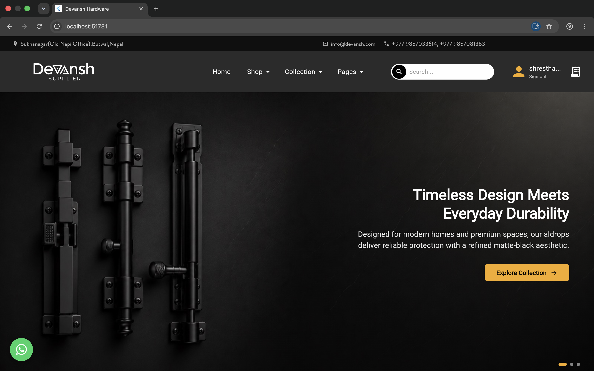
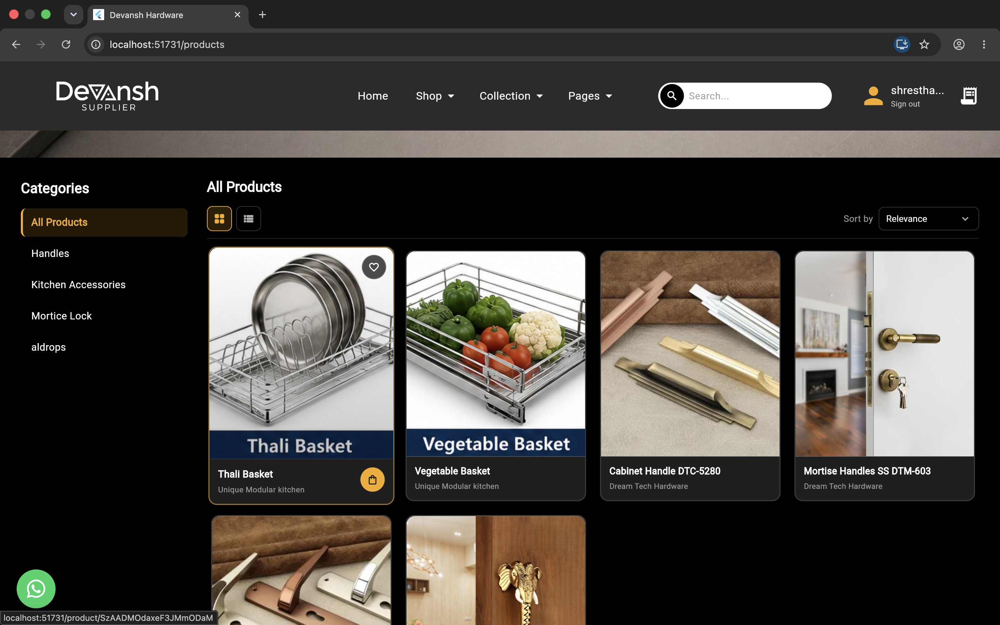
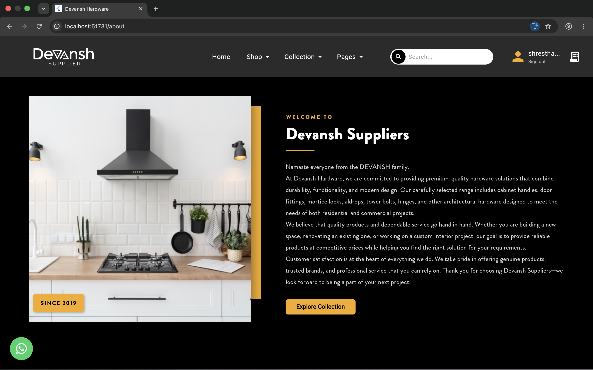
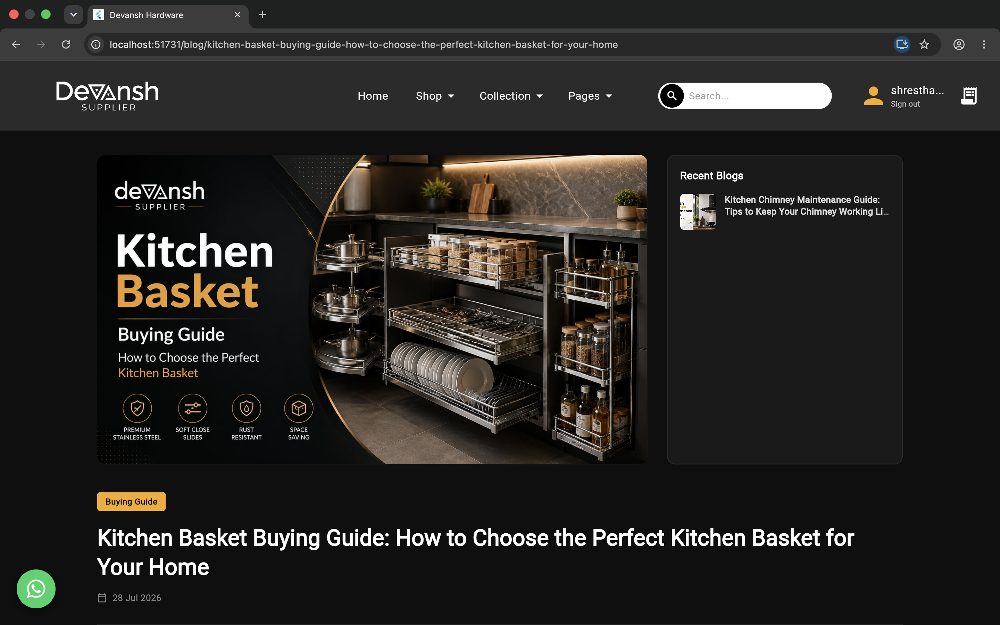
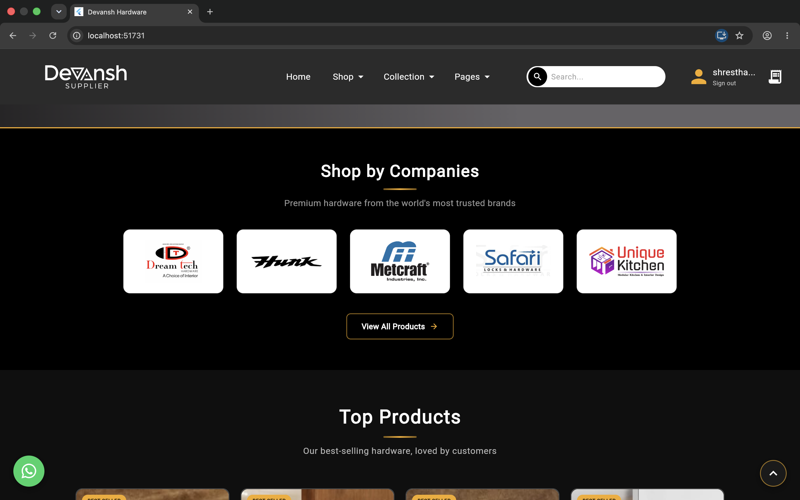
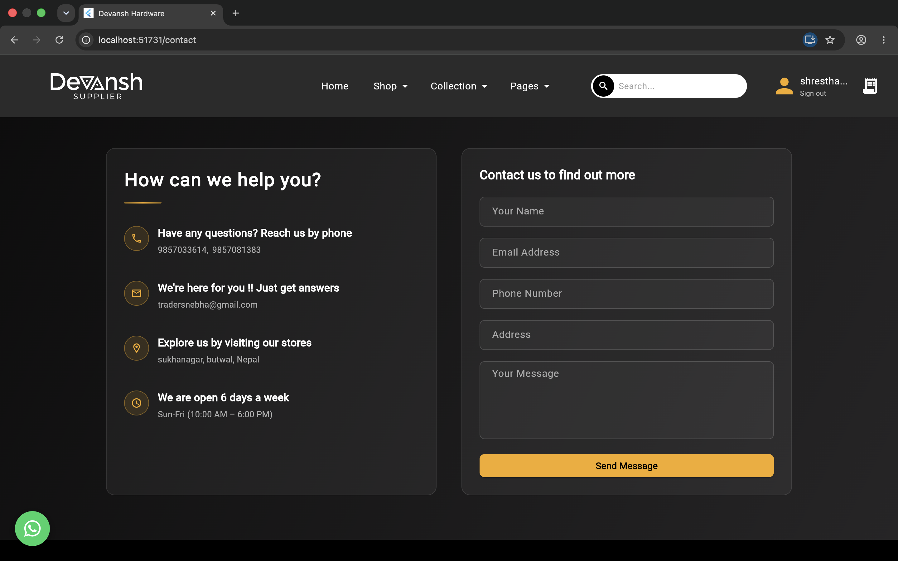
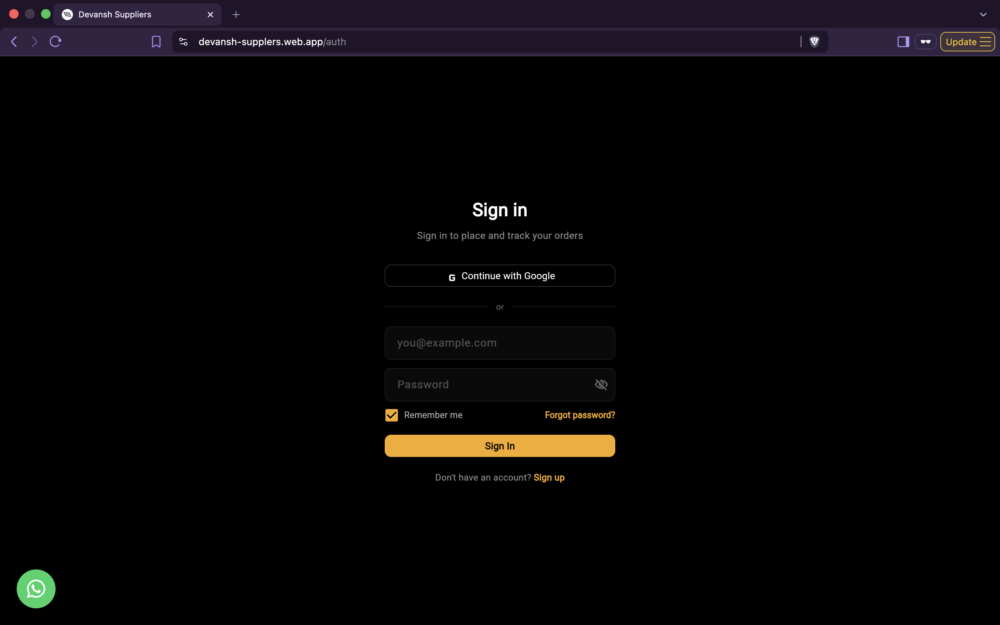
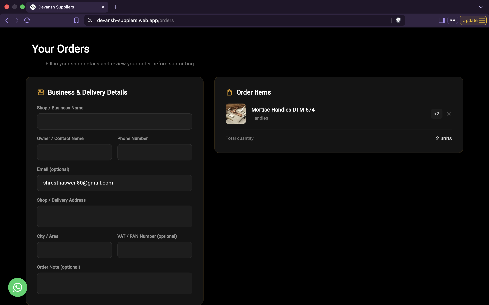

# Devansh Suppliers

A B2B hardware and cabinet fittings catalog and ordering platform — browse products by category, material, and company, and place orders directly online.

🔗 **Live site:** [devansh-supplers.web.app](https://devansh-supplers.web.app)

---

## 📸 Screenshots

<!--
Add your screenshots to a `screenshots/` folder in the repo root, then
update the paths below to match your actual filenames.
-->

| Home / Catalog | Product Details |
|---|---|
|  |  |


|---|---|
|  |  |


|---|---|
|  |  |


| Sign In | Order Placement |
|---|---|
|  |  |

---

## ✨ Features

- **Product catalog** — browse by category, material, product type, and company/brand
- **Email/password and Google sign-in**, with email verification required before account activation
- **Password reset** via a secure emailed link that opens directly back into the app
- **Order placement** — submit orders with shop details, contact info, and item quantities
- **Customer reviews** with an admin moderation/approval step before going live
- **Blog section** for company updates and content
- **Fully responsive** Flutter web app

## 🛠️ Tech Stack

- **[Flutter Web](https://flutter.dev)** — UI framework
- **[Firebase Authentication](https://firebase.google.com/products/auth)** — email/password + Google sign-in
- **[Cloud Firestore](https://firebase.google.com/products/firestore)** — database for products, orders, reviews, blogs
- **[Firebase Hosting](https://firebase.google.com/products/hosting)** — deployment with custom security headers
- **[Cloudinary](https://cloudinary.com)** — image hosting and delivery
- **[go_router](https://pub.dev/packages/go_router)** — declarative routing
- **GitHub Actions** — CI/CD, auto-deploy on push to `main`

## 🔒 Security

This project follows a few deliberate security practices:

- Firestore security rules enforce per-collection access control (public read for catalog data, owner-only access for orders, admin-gated writes)
- Firebase Hosting is configured with security headers (`Strict-Transport-Security`, `X-Frame-Options`, `X-Content-Type-Options`, `Referrer-Policy`, `Permissions-Policy`)
- API key restricted by domain and by API scope in Google Cloud Console
- TLS/SSL automatically provisioned and renewed via Firebase Hosting (SSL Labs grade: **A+**)
- Dependencies checked for known vulnerabilities before release

## 🚀 Getting Started

### Prerequisites

- [Flutter SDK](https://docs.flutter.dev/get-started/install) (stable channel)
- A Firebase project with Authentication, Firestore, and Hosting enabled

### Setup

```bash
# Clone the repo
git clone https://github.com/<your-username>/<your-repo>.git
cd <your-repo>

# Install dependencies
flutter pub get

# Run locally (web)
flutter run -d chrome
```

### Firebase configuration

This project expects a `lib/firebase_options.dart` file generated via the [FlutterFire CLI](https://firebase.google.com/docs/flutter/setup):

```bash
flutterfire configure
```

## 📦 Build & Deploy

```bash
flutter build web
firebase deploy --only hosting
```

Deployment is also automated via **GitHub Actions** — every push to `main` triggers a build and deploy to Firebase Hosting.


## 📄 License

<!-- Add your license here, e.g. MIT, or state "All rights reserved" if private -->

---

Built with ❤️ for Devansh Suppliers.